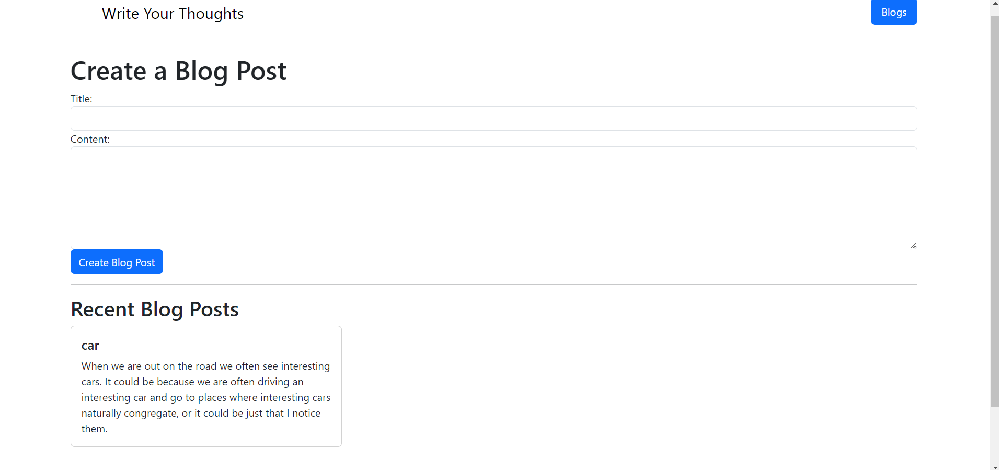

# Project Name

A simple blog application built with Express.js.


## Preview




## Description

This project is a simple blog application created using Express.js. It allows users to create new blog posts and view recent blog posts on the homepage.

## Installation

1. Clone the repository:
   ```bash
   git clone https://github.com/KRISHNAKUMARPS2002/Simple-Blog-Website.git
